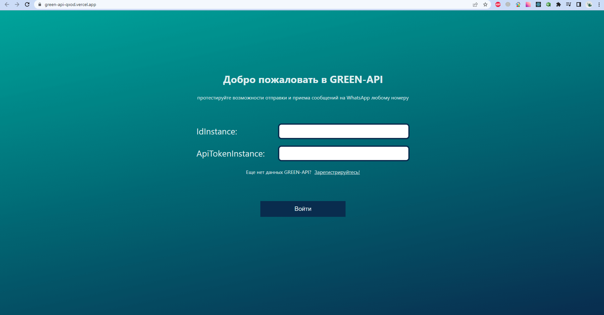
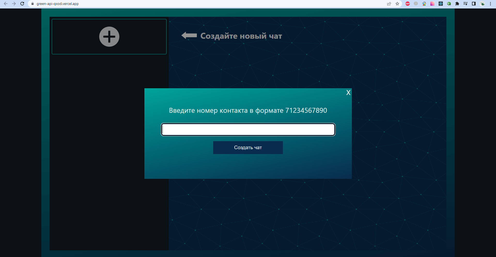
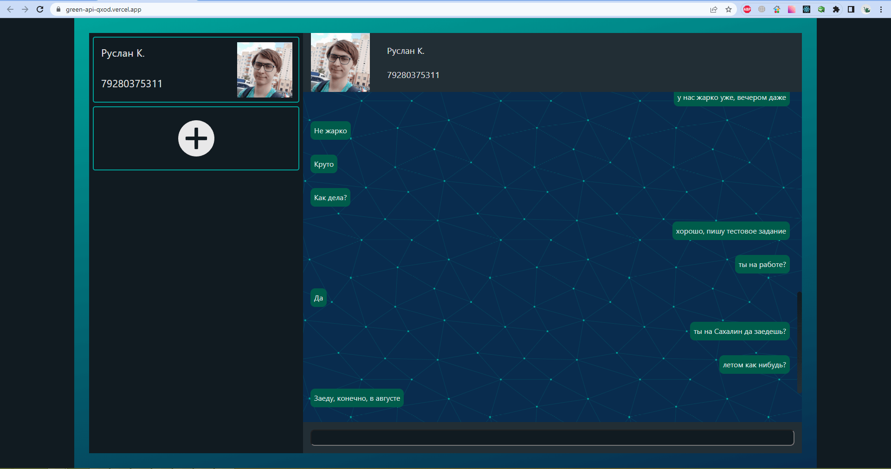

# Тестовое задание [GREEN-API](https://green-api.com/)

*возможности GREEN-API на примере отправки и получения сообщений WhatsApp через сайт*

*развёрнут на платформе Vercel:*
## https://green-api-qxod.vercel.app


# Описание 
Сайт представляет из себя демонстацию возможности отправки и приёма сообщений на любой номер WhatsApp, используя учётную запись GREEN-API:
- авторизация на главной странице
> 
- создание нового чата
> 
- отправка и приём сообщений
> 
> <video src="media/record.mp4" autoplay loop>

# Информация разработки
- cайт написан на библиотеке **`React`** c использованием **`TypeScript`**
- cобран с помощью **`Vite`**
- применяется библиотека **`React-redux`** - для глобального управления стейтами
- развёрнут на платформе **`Vercel`**

### Технологии: 
 - используются функциональные компоненты
 - реализована обработка ошибок

*описание работы функций можно найти в коментариях кода*

# Запустить локально

1. Клонировать репозиторий
```
git clone https://github.com/RemixFX/green-api.git
```
2. Перейти в папку проекта, установить зависимости
```
npm install
```
3. Запустить проект
```
npm run preview
```
___


